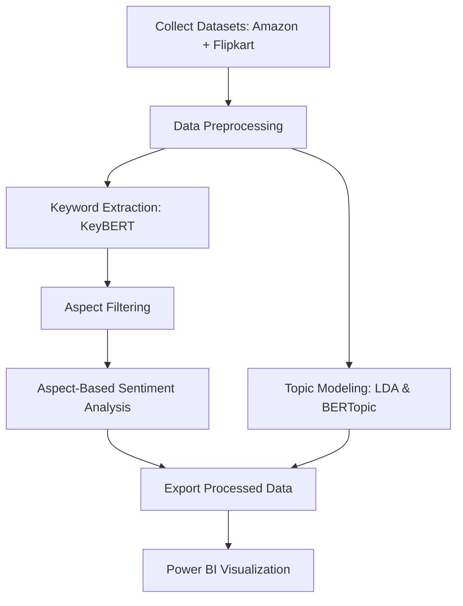
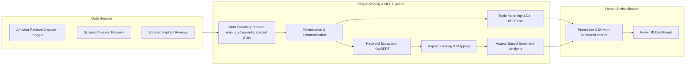

# 📊 Social Media and Online Platform Analytics for Business Insights

> **A complete NLP pipeline** for extracting actionable insights from Amazon & Flipkart smartphone reviews using Topic Modeling (LDA, BERTopic), Keyword Extraction (KeyBERT), and Aspect-Based Sentiment Analysis (ABSA), with interactive visualizations in Power BI.

---

## 📝 Table of Contents
1. [Introduction](#introduction)
2. [Key Features](#key-features)
3. [Dataset](#dataset)
4. [Methodology](#methodology)
    - [Mermaid Workflow Diagram](#mermaid-workflow-diagram)
5. [Results Summary](#results-summary)
6. [Project Structure](#project-structure)
7. [Installation](#installation)
8. [Usage](#usage)
9. [Visualizations](#visualizations)
10. [Challenges](#challenges)
11. [Future Work](#future-work)
12. [License](#license)

---

## 📌 Introduction
In today’s digital era, customer reviews on social media and e-commerce platforms hold **valuable business insights**. This project builds a **data pipeline** to:
- Identify discussion topics and aspects from reviews.
- Measure sentiment for each aspect.
- Present actionable insights via **Power BI dashboards**.

We evaluated multiple techniques:
- **LDA** for high-level topic themes.
- **BERTopic** for contextual clustering.
- **KeyBERT + ABSA** for fine-grained sentiment insights.

---

## 🚀 Key Features
- **Topic Modeling**: LDA & BERTopic for theme extraction.
- **Keyword Extraction**: BERT-based semantic keyword identification.
- **Aspect-Based Sentiment Analysis (ABSA)**: Sentiment scores for each product-aspect pair.
- **Interactive Dashboard**: Power BI visualizations for insights.
- **Comparative Analysis**: Evaluate trade-offs between modeling techniques.

---

## 📂 Dataset
We used:
- **Amazon Reviews Dataset** from Kaggle.
- **Scraped Amazon & Flipkart Reviews**.

**Key columns**:
- Product Name
- Review Text
- Rating
- Review Date

---

## 🔍 Methodology
Our NLP pipeline consists of the following stages:

1. **Data Preprocessing**
   - Cleaning (remove emojis, stopwords, special characters)
   - Tokenization & Lemmatization
   - Filter relevant columns

2. **Topic Modeling**
   - LDA (Gensim) for interpretable topics.
   - BERTopic for contextual embeddings & clustering.

3. **Keyword Extraction**
   - KeyBERT to extract the top 300 high-frequency keywords.
   - Manual filtering to retain meaningful product aspects.

4. **Aspect-Based Sentiment Analysis**
   - Map each review to relevant aspects.
   - Calculate:
     - % Positive Sentiment
     - % Negative Sentiment
     - Average Sentiment Score
     - Number of Mentions

5. **Visualization**
   - Export processed data to **Power BI**.
   - Build interactive dashboards for stakeholders.

---

## 📊 Mermaid Workflow Diagram


---

## 📈 Results Summary

### LDA
- **Topics Generated:** 8  
- **Coherence Score:** `0.695` (tuned)  

### BERTopic
- **Best Silhouette Score:** `0.4752` (tuned)  
- More nuanced but harder to interpret.

### KeyBERT + ABSA
- **Aspects Analyzed:** 24 (e.g., camera, battery, screen, warranty)  
- Identified both expected and unexpected aspects (e.g., emotional words like *love*, *bad*).  
- Delivered precise, actionable insights.

---

## 📂 Project Structure
```bash
social-media-insights/
│
├── data/           # Raw & processed CSV datasets
├── models/         # Saved LDA/BERTopic artifacts
├── src/            # Python scripts
│   ├── ABSA.py
│   ├── KeyBERT.py
│   ├── LDA.py
│   ├── aspects.py
│   ├── product_names.py
├── requirements.txt
├── README.md
└── .gitignore
```

---

## ⚙️ Installation
```bash
git clone https://github.com/yourusername/social-media-insights.git
cd social-media-insights
pip install -r requirements.txt
```

---

## ▶️ Usage

To run the different components of the project, use the following commands:

* **Aspect-Based Sentiment Analysis (ABSA)**
    ```bash
    python src/ABSA.py
    ```

* **Keyword Extraction**
    ```bash
    python src/KeyBERT.py
    ```

* **Topic Modeling**
    ```bash
    python src/LDA.py
    ```

---

## 📊 Visualizations

The **Power BI dashboard** provides a comprehensive overview of the analysis with the following key visualizations:

* Average Sentiment by Aspect & Product
* Number of Mentions by Aspect
* Positive vs Negative Sentiment %
* Top Aspects Driving User Satisfaction or Dissatisfaction

## 📊 Data Flow Diagram



## ⚠️ Challenges

Throughout this project, we encountered a few key challenges:

* **Data preprocessing** was resource-intensive due to the heterogeneous nature of the data sources.
* The **aspect lexicon** was specifically tuned for smartphones and will require adaptation for other product domains.

---

## 🔮 Future Work

Future enhancements and areas for expansion include:

* Implementing **Transformer-based ABSA** (e.g., T5-ABSA) for improved accuracy.
* Automating aspect discovery through **embedding clustering**.
* Expanding the analysis to **multi-lingual and multi-platform datasets**.

---

## 📜 License

This project is licensed under the **MIT License**.


